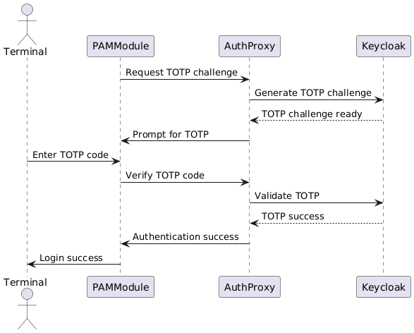

# Authentication Flows

This document details the authentication flows within the CSIP Authentication System, covering initial login, multi-factor authentication (MFA) methods, and elevated privilege (sudo) authentication. The flows are illustrated with sequence diagrams to provide clear visual representations of the interactions between components.

## Table of Contents

1. [Authentication Conditions](#authentication-conditions)
2. [MFA Authentication Methods](#mfa-authentication-methods)
   - [TOTP Authentication](#totp-authentication)
   - [WebAuthn/FIDO2 Authentication](#webauthnfido2-authentication)
3. [New User Registration Flow](#new-user-registration-flow)
4. [Sudo Command Authentication](#sudo-command-authentication)

## Authentication Conditions

The CSIP Authentication System handles three distinct user conditions during the authentication process:

### Condition 1: User Exists Locally in Keycloak

This applies to users directly managed in Keycloak, either imported via user federation (LDAP) or manually created.

*Figure 1: Authentication flow for users that exist locally in Keycloak*

**Process Details:**
1. System verifies the user exists locally in Keycloak
2. User is prompted for password
3. System verifies the password against Keycloak
4. System checks if MFA is configured:
   - If MFA is enabled: Proceed with MFA verification (TOTP or WebAuthn)
   - If no MFA is enabled: Prompt user to set up MFA (choose between WebAuthn or TOTP)
5. After successful MFA verification or setup, authentication is completed

### Condition 2: User Exists in External IdP (Known to Keycloak)

This applies to users managed by an external identity provider that Keycloak is integrated with.

*Figure 2: Authentication flow for users that exist in an external IdP integrated with Keycloak*

**Process Details:**
1. System identifies the user exists in an external IdP integrated with Keycloak
2. System generates a URL for authenticating with the appropriate IdP
3. User opens the URL in a browser and completes authentication with the IdP
4. After successful IdP authentication, the system checks MFA status:
   - If MFA is configured: Proceed with MFA verification
   - If MFA is not configured: Guide the user through MFA setup
5. PAM module polls for authentication status
6. Once authentication and MFA verification are complete, the user is granted access

### Condition 3: New User (Not in Keycloak)

This applies to users who don't exist in Keycloak or any connected IdP, requiring heuristic validation.

*Figure 3: Authentication flow for new users not yet present in Keycloak*

**Process Details:**
1. System determines the user doesn't exist in Keycloak or any connected IdP
2. User is prompted for email or domain identifier to heuristically determine the appropriate IdP
3. System generates an authentication URL for the selected IdP
4. User authenticates with the IdP in a browser
5. Upon successful authentication with the IdP, the system:
   - Creates a new user in Keycloak based on the IdP identity
   - Terminates the current session
6. User is prompted to log in again (which will now follow Condition 2 flow)

This approach ensures that:
- New users can self-register through their organization's IdP
- User accounts are properly created in Keycloak for future authentication
- The system maintains a consistent authentication flow regardless of user origin

## MFA Authentication Methods

The CSIP Authentication System supports multiple MFA methods, each with its own authentication flow.

### TOTP Authentication

Time-based One-Time Password (TOTP) authentication can be completed entirely within the terminal:

*Figure 4: TOTP authentication flow*

#### TOTP Process Details:

1. After password verification, the system initiates the TOTP challenge
2. User is prompted to enter the TOTP code from their authenticator app
3. The code is transmitted to the auth proxy and verified against Keycloak
4. If valid, authentication is successful

### WebAuthn/FIDO2 Authentication

For hardware security keys, fingerprint readers, and other WebAuthn/FIDO2 authenticators:

*Figure 5: WebAuthn/FIDO2 authentication flow*

#### WebAuthn/FIDO2 Process Details:

1. After password verification, the system initiates the WebAuthn challenge
2. The PAM module displays a unique URL to the user
3. User opens the URL in a browser on any device
4. The browser initiates the WebAuthn protocol
5. User interacts with their security key/fingerprint reader/etc.
6. Browser sends the authentication response to the auth proxy
7. Auth proxy verifies the response with Keycloak
8. Meanwhile, the PAM module polls the auth proxy for status
9. Once verified, authentication is approved

## New User Registration Flow

For new users who don't yet have an account in any connected IdP:

*Figure 6: New user registration flow*

### New User Registration Process:

1. User attempts to login with a username not found in any IdP
2. System prompts for an email address to determine appropriate IdP
3. Based on email domain, system routes to the appropriate IdP's registration flow
4. User is provided a unique registration URL
5. User completes the registration process in a browser
6. User is required to set up MFA as part of registration
7. Once registration is complete, user is prompted to retry authentication
8. Normal authentication flow proceeds

## Sudo Command Authentication

Sudo command authentication follows the same principles as the login flow, adapting based on the user's account type and their configured MFA method (TOTP or WebAuthn). This consistent approach ensures security while maintaining a familiar user experience.

### Sudo Authentication Flow

The sudo authentication flow mirrors the login flow but is specifically triggered for privileged command execution. The flow branches based on the user account type and configured MFA method (TOTP or WebAuthn).

*Figure 7: Sudo command authentication flow with branching based on MFA method*

The diagram above illustrates how sudo authentication adapts based on the user's configured MFA method. The process begins with a sudo command request and then branches into either TOTP verification (directly in the terminal) or WebAuthn verification (using a browser and security key), depending on the user's configured MFA method.

### Key Aspects of Sudo Authentication:

1. **User Type Detection**: System determines the user's account type (local Keycloak or external IdP)
2. **MFA Method Application**: The same MFA method configured for login is used for sudo
3. **Command Context**: The sudo verification includes details of the command being executed
4. **Time-Limited Approval**: Sudo verification is valid only for a short time window
5. **Audit Trail**: Each sudo command verification is logged with full command details

This approach ensures:
- Consistent user experience between login and sudo operations
- Authentication method appropriate to the user's account type
- Proper security context for the privileged command being executed
- Comprehensive audit trail of all privileged operations
